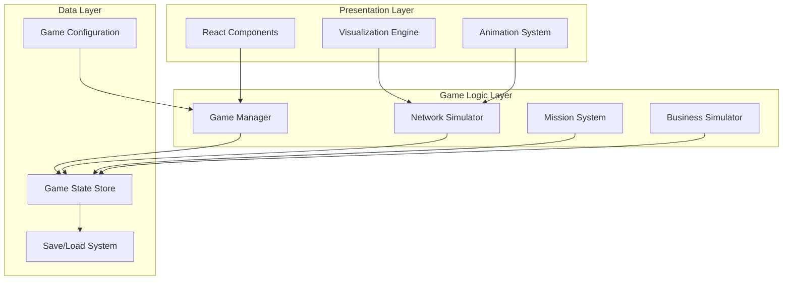

# Quick Build: NetFlow - The Network Engineering Game

## Goal
An educational RPG-style game that teaches network engineering fundamentals through an interactive plumbing-metaphor visualization, where players manage IT infrastructure for a growing small business.

---

## Quick Start Requirements

| Aspect | Details |
|--------|---------|
| **App Type** | Web Application (Single Page App) |
| **Users** | Students, IT beginners, self-learners (1-1000 concurrent) |
| **Input** | Mouse/touch interactions, drag-and-drop, configuration forms |
| **Output** | Animated visualizations, game state, progress tracking |
| **Integrations** | None for MVP (future: cloud save, leaderboards) |

---

## Technology Choice

| Component | Choice | Rationale |
|-----------|--------|-----------|
| **Language** | TypeScript | Type safety for complex game state |
| **Framework** | React 18+ | Component-based UI, excellent for interactive apps |
| **State Management** | Zustand | Lightweight, perfect for game state |
| **Animation** | Framer Motion | Smooth animations for packet flow |
| **Styling** | Tailwind CSS | Rapid UI development |
| **Build Tool** | Vite | Fast development, optimized builds |
| **Data Storage** | localStorage (MVP) → IndexedDB (future) |
| **Testing** | Vitest + React Testing Library |

### Key Dependencies
```json
{
  "react": "^18.2.0",
  "typescript": "^5.0.0",
  "zustand": "^4.4.0",
  "framer-motion": "^10.0.0",
  "tailwindcss": "^3.3.0",
  "lucide-react": "^0.263.0",
  "uuid": "^9.0.0"
}
```

---

## Game Architecture Overview



---

## Core Domain Models

### Network Entities

```typescript
// ============================================================
// CORE TYPES - Network Infrastructure
// ============================================================

type DeviceType = 'router' | 'switch' | 'computer' | 'server' | 'firewall';
type ConnectionType = 'ethernet' | 'fiber' | 'wireless';
type PacketType = 'tcp' | 'udp' | 'icmp' | 'dns' | 'http' | 'https';
type PacketState = 'created' | 'in-transit' | 'delivered' | 'dropped' | 'blocked';

interface Position {
  x: number;
  y: number;
}

interface IPv4Address {
  octets: [number, number, number, number]; // [192, 168, 1, 1]
  cidr?: number; // Optional subnet mask in CIDR notation
}

interface MACAddress {
  segments: [string, string, string, string, string, string]; // ["AA", "BB", "CC", "DD", "EE", "FF"]
}

interface PortNumber {
  value: number; // 1-65535
  protocol: 'tcp' | 'udp';
}

// ============================================================
// NETWORK DEVICES
// ============================================================

interface NetworkDevice {
  id: string;
  type: DeviceType;
  name: string;
  position: Position;
  status: 'online' | 'offline' | 'error' | 'configuring';
  interfaces: NetworkInterface[];
  config: DeviceConfig;
  purchaseCost: number;
  monthlyOperatingCost: number;
}

interface NetworkInterface {
  id: string;
  name: string; // "eth0", "wan", "lan1", etc.
  macAddress: MACAddress;
  ipAddress?: IPv4Address;
  subnetMask?: IPv4Address;
  gateway?: IPv4Address;
  isUp: boolean;
  speed: number; // Mbps
  connectedTo?: string; // ID of connected interface
}

interface DeviceConfig {
  hostname: string;
  [key: string]: any; // Device-specific configuration
}

// ============================================================
// ROUTER SPECIFIC
// ============================================================

interface Router extends NetworkDevice {
  type: 'router';
  config: RouterConfig;
}

interface RouterConfig extends DeviceConfig {
  nat: NATConfig;
  firewall: FirewallConfig;
  dhcp?: DHCPConfig;
  routes: StaticRoute[];
}

interface NATConfig {
  enabled: boolean;
  type: 'pat' | 'static' | 'dynamic'; // PAT (Port Address Translation) for MVP
  insideInterface: string; // Interface ID
  outsideInterface: string; // Interface ID
  translations: NATTranslation[]; // Active translations (runtime)
  staticMappings: StaticNATMapping[]; // Port forwarding rules
}

interface NATTranslation {
  id: string;
  insideAddress: IPv4Address;
  insidePort: number;
  outsideAddress: IPv4Address;
  outsidePort: number;
  protocol: 'tcp' | 'udp';
  createdAt: number;
  lastUsed: number;
  state: 'active' | 'expired';
}

interface StaticNATMapping {
  id: string;
  name: string; // User-friendly name
  externalPort: number;
  internalAddress: IPv4Address;
  internalPort: number;
  protocol: 'tcp' | 'udp' | 'both';
  enabled: boolean;
}

interface FirewallConfig {
  enabled: boolean;
  defaultInboundPolicy: 'allow' | 'deny';
  defaultOutboundPolicy: 'allow' | 'deny';
  rules: FirewallRule[];
  statefulInspection: boolean; // Track connection states
  connectionTable: ConnectionState[]; // Active connections (runtime)
}

interface FirewallRule {
  id: string;
  name: string;
  priority: number; // Lower = higher priority
  direction: 'inbound' | 'outbound' | 'both';
  action: 'allow' | 'deny' | 'log';
  sourceAddress?: IPv4Address | 'any';
  sourcePort?: number | 'any';
  destinationAddress?: IPv4Address | 'any';
  destinationPort?: number | 'any';
  protocol?: 'tcp' | 'udp' | 'icmp' | 'any';
  enabled: boolean;
}

interface ConnectionState {
  id: string;
  sourceAddress: IPv4Address;
  sourcePort: number;
  destinationAddress: IPv4Address;
  destinationPort: number;
  protocol: 'tcp' | 'udp';
  state: 'new' | 'established' | 'related' | 'closing';
  tcpState?: TCPState;
  createdAt: number;
  lastActivity: number;
  packetsIn: number;
  packetsOut: number;
}

type TCPState = 
  | 'listen' 
  | 'syn-sent' 
  | 'syn-received' 
  | 'established' 
  | 'fin-wait-1' 
  | 'fin-wait-2' 
  | 'close-wait' 
  | 'closing' 
  | 'last-ack' 
  | 'time-wait' 
  | 'closed';

interface DHCPConfig {
  enabled: boolean;
  poolStart: IPv4Address;
  poolEnd: IPv4Address;
  subnetMask: IPv4Address;
  gateway: IPv4Address;
  dns: IPv4Address[];
  leaseTime: number; // seconds
  leases: DHCPLease[];
}

interface DHCPLease {
  macAddress: MACAddress;
  ipAddress: IPv4Address;
  hostname?: string;
  leaseStart: number;
  leaseEnd: number;
}

interface StaticRoute {
  id: string;
  destination: IPv4Address;
  subnetMask: IPv4Address;
  nextHop: IPv4Address;
  interface: string;
  metric: number;
}

// ============================================================
// SWITCH SPECIFIC
// ============================================================

interface Switch extends NetworkDevice {
  type: 'switch';
  config: SwitchConfig;
}

interface SwitchConfig extends DeviceConfig {
  macTable: MACTableEntry[];
  vlans?: VLAN[]; // Future phases
}

interface MACTableEntry {
  macAddress: MACAddress;
  port: string; // Interface ID
  vlan?: number;
  learned: number; // Timestamp
  type: 'dynamic' | 'static';
}

interface VLAN {
  id: number;
  name: string;
  ports: string[]; // Interface IDs
}

// ============================================================
// COMPUTER/ENDPOINT SPECIFIC
// ============================================================

interface Computer extends NetworkDevice {
  type: 'computer';
  config: ComputerConfig;
  assignedTo?: string; // Employee ID
}

interface ComputerConfig extends DeviceConfig {
  ipConfig: 'dhcp' | 'static';
  dnsServers: IPv4Address[];
  applications: Application[];
}

interface Application {
  id: string;
  name: string;
  icon: string;
  trafficProfile: TrafficProfile;
  isRunning: boolean;
}

interface TrafficProfile {
  protocol: 'tcp' | 'udp';
  destinationPorts: number[];
  averageBandwidth: number; // Kbps
  burstBandwidth: number; // Kbps
  packetFrequency: number; // packets per second
}

// ============================================================
// CONNECTIONS (CABLES/PIPES)
// ============================================================

interface Connection {
  id: string;
  type: ConnectionType;
  fromDevice: string; // Device ID
  fromInterface: string; // Interface ID
  toDevice: string; // Device ID
  toInterface: string; // Interface ID
  bandwidth: number; // Mbps
  latency: number; // ms
  packetLoss: number; // 0-1 percentage
  status: 'connected' | 'disconnected' | 'error';
  visualPath?: Position[]; // Points for rendering curved pipes
}

// ============================================================
// PACKETS (DATA FLOW)
// ============================================================

interface Packet {
  id: string;
  type: PacketType;
  state: PacketState;
  
  // Layer 2
  sourceMac: MACAddress;
  destinationMac: MACAddress;
  
  // Layer 3
  sourceIp: IPv4Address;
  destinationIp: IPv4Address;
  ttl: number;
  
  // Layer 4
  sourcePort: number;
  destinationPort: number;
  protocol: 'tcp' | 'udp';
  
  // TCP specific
  tcpFlags?: {
    syn: boolean;
    ack: boolean;
    fin: boolean;
    rst: boolean;
    psh: boolean;
  };
  sequenceNumber?: number;
  acknowledgmentNumber?: number;
  
  // Payload
  payload: PacketPayload;
  
  // Simulation
  createdAt: number;
  currentPosition: Position;
  currentDevice?: string;
  route: string[]; // Device IDs in order
  routeIndex: number;
  animationProgress: number; // 0-1 for smooth animation
  
  // Visual
  color: string;
  size: 'small' | 'medium' | 'large';
  highlighted: boolean;
}

interface PacketPayload {
  type: 'http-request' | 'http-response' | 'dns-query' | 'dns-response' | 
        'email' | 'file-transfer' | 'video-stream' | 'attack' | 'generic';
  size: number; // bytes
  description: string;
  data?: any;
}
```

### Business Simulation Entities

```typescript
// ============================================================
// BUSINESS SIMULATION
// ============================================================

interface Business {
  id: string;
  name: string;
  type: BusinessType;
  founded: number; // Game day
  
  // Financial
  cash: number;
  monthlyRevenue: number;
  monthlyExpenses: number;
  itBudget: number;
  
  // Growth
  level: number; // Business growth level
  reputation: number; // 0-100
  
  // Staff
  employees: Employee[];
  maxEmployees: number;
  
  // Infrastructure
  offices: Office[];
}

type BusinessType = 
  | 'design-agency' 
  | 'software-startup' 
  | 'consulting-firm' 
  | 'retail-shop'
  | 'manufacturing';

interface Employee {
  id: string;
  name: string;
  role: EmployeeRole;
  avatar: string;
  hireDate: number;
  salary: number;
  
  // Work simulation
  productivity: number; // 0-100, affected by network quality
  satisfaction: number; // 0-100
  currentTask?: Task;
  assignedComputer?: string; // Computer device ID
  
  // Network usage
  trafficProfile: EmployeeTrafficProfile;
}

type EmployeeRole = 
  | 'designer' 
  | 'developer' 
  | 'manager' 
  | 'sales' 
  | 'support' 
  | 'executive';

interface EmployeeTrafficProfile {
  webBrowsing: number; // 0-10 intensity
  email: number;
  fileTransfers: number;
  videoConferencing: number;
  cloudApps: number;
}

interface Task {
  id: string;
  name: string;
  requiredBandwidth: number;
  duration: number; // Game minutes
  progress: number; // 0-100
  networkDependent: boolean;
}

interface Office {
  id: string;
  name: string;
  location: string;
  size: 'small' | 'medium' | 'large';
  maxWorkstations: number;
  networkZone: string; // For VLAN mapping in later phases
}

// ============================================================
// GAME EVENTS
// ============================================================

interface GameEvent {
  id: string;
  type: EventType;
  title: string;
  description: string;
  triggerCondition: EventTrigger;
  effects: EventEffect[];
  choices?: EventChoice[];
  priority: 'low' | 'medium' | 'high' | 'critical';
  duration?: number; // How long event lasts
  resolved: boolean;
}

type EventType = 
  | 'business-growth'      // New employee, revenue increase
  | 'network-issue'        // Outage, slow performance
  | 'security-threat'      // Hacking attempt, malware
  | 'hardware-failure'     // Device dies
  | 'new-requirement'      // Boss wants new capability
  | 'random-opportunity'   // Discount on hardware
  | 'tutorial';            // Teaching moment

interface EventTrigger {
  type: 'time' | 'condition' | 'random' | 'mission';
  value: any;
}

interface EventEffect {
  type: 'modify-cash' | 'modify-reputation' | 'spawn-packets' | 
        'damage-device' | 'add-employee' | 'unlock-feature';
  target?: string;
  value: any;
}

interface EventChoice {
  id: string;
  text: string;
  effects: EventEffect[];
  requirements?: ChoiceRequirement[];
}

interface ChoiceRequirement {
  type: 'cash' | 'device' | 'skill';
  value: any;
}
```

### Mission System

```typescript
// ============================================================
// MISSION/LEARNING SYSTEM
// ============================================================

interface Mission {
  id: string;
  phase: number;
  order: number;
  
  // Display
  title: string;
  briefing: string; // Story/context
  objectives: Objective[];
  
  // Learning
  learningObjectives: LearningObjective[];
  hints: Hint[];
  
  // Requirements
  prerequisites: string[]; // Mission IDs
  unlocks: string[]; // What completing this unlocks
  
  // Rewards
  rewards: Reward[];
  
  // State
  status: 'locked' | 'available' | 'active' | 'completed' | 'failed';
  startedAt?: number;
  completedAt?: number;
}

interface Objective {
  id: string;
  description: string;
  type: ObjectiveType;
  target: any; // Depends on type
  current: number;
  required: number;
  completed: boolean;
  optional: boolean;
}

type ObjectiveType = 
  | 'connect-device'        // Connect X to network
  | 'assign-ip'             // Give device an IP
  | 'configure-nat'         // Set up NAT
  | 'configure-firewall'    // Set up firewall rules
  | 'achieve-connectivity'  // Device can reach internet
  | 'block-attack'          // Successfully block malicious traffic
  | 'maintain-uptime'       // Keep network up for X time
  | 'troubleshoot'          // Fix a specific problem
  | 'optimize-performance'; // Achieve X throughput

interface LearningObjective {
  id: string;
  concept: NetworkConcept;
  description: string;
  assessmentType: 'observation' | 'action' | 'quiz';
  completed: boolean;
}

type NetworkConcept = 
  | 'ipv4-addressing'
  | 'private-vs-public-ip'
  | 'subnetting-basics'
  | 'nat-purpose'
  | 'nat-operation'
  | 'tcp-handshake'
  | 'stateful-firewall'
  | 'port-numbers'
  | 'packet-flow'
  | 'switching-basics'
  | 'routing-basics';

interface Hint {
  id: string;
  order: number;
  condition: HintCondition;
  content: string;
  type: 'tooltip' | 'dialog' | 'highlight';
  target?: string; // UI element to highlight
}

interface HintCondition {
  type: 'time-elapsed' | 'attempts-failed' | 'requested' | 'stuck-on-step';
  value: any;
}

interface Reward {
  type: 'cash' | 'unlock-hardware' | 'unlock-feature' | 'xp' | 'achievement';
  value: any;
  description: string;
}
```

### Game State

```typescript
// ============================================================
// GAME STATE (ZUSTAND STORE)
// ============================================================

interface GameState {
  // Meta
  version: string;
  saveSlot: number;
  lastSaved: number;
  
  // Time
  gameTime: GameTime;
  isPaused: boolean;
  gameSpeed: 1 | 2 | 4;
  
  // Progress
  currentPhase: number;
  currentMission?: string;
  completedMissions: string[];
  unlockedFeatures: string[];
  
  // Business
  business: Business;
  
  // Network
  network: NetworkState;
  
  // Simulation
  simulation: SimulationState;
  
  // UI
  ui: UIState;
  
  // Player
  player: PlayerState;
}

interface GameTime {
  day: number;
  hour: number;
  minute: number;
  totalMinutes: number;
}

interface NetworkState {
  devices: Record<string, NetworkDevice>;
  connections: Record<string, Connection>;
  packets: Record<string, Packet>;
  
  // Derived/cached
  topology: NetworkTopology;
}

interface NetworkTopology {
  // Graph representation for routing
  adjacencyList: Record<string, string[]>;
  // Quick lookups
  devicesByType: Record<DeviceType, string[]>;
  // Internet gateway
  internetGateway?: string; // Router ID
  publicIP?: IPv4Address;
}

interface SimulationState {
  isRunning: boolean;
  tickRate: number; // ms per tick
  lastTick: number;
  
  // Attack simulation
  activeThreats: Threat[];
  blockedAttacks: number;
  successfulAttacks: number;
  
  // Performance metrics
  metrics: NetworkMetrics;
}

interface Threat {
  id: string;
  type: 'port-scan' | 'brute-force' | 'ddos' | 'malware';
  sourceIP: IPv4Address;
  targetPort?: number;
  intensity: number;
  startedAt: number;
  packets: string[]; // Packet IDs
}

interface NetworkMetrics {
  uptime: number; // Percentage
  averageLatency: number;
  packetLoss: number;
  throughput: number;
  activeConnections: number;
}

interface UIState {
  currentView: 'office' | 'network' | 'config' | 'shop' | 'missions';
  selectedDevice?: string;
  selectedConnection?: string;
  showDataFlow: boolean;
  showLabels: boolean;
  zoom: number;
  pan: Position;
  
  // Modals
  activeModal?: ModalType;
  modalData?: any;
  
  // Tutorial
  tutorialStep?: number;
  highlightedElements: string[];
}

type ModalType = 
  | 'device-config'
  | 'shop'
  | 'mission-briefing'
  | 'mission-complete'
  | 'event'
  | 'help'
  | 'settings';

interface PlayerState {
  name: string;
  xp: number;
  level: number;
  achievements: Achievement[];
  preferences: PlayerPreferences;
}

interface Achievement {
  id: string;
  name: string;
  description: string;
  icon: string;
  unlockedAt: number;
}

interface PlayerPreferences {
  animationSpeed: 'slow' | 'normal' | 'fast';
  showTutorials: boolean;
  soundEnabled: boolean;
  musicEnabled: boolean;
  colorblindMode: boolean;
}
```

---

## Visual System: The Pipe Metaphor

### Visual Mapping Reference

```typescript
// ============================================================
// VISUAL CONSTANTS AND MAPPINGS
// ============================================================

const VISUAL_METAPHORS = {
  // Network to Plumbing mapping
  concepts: {
    'data-packet': 'water droplet',
    'bandwidth': 'pipe diameter',
    'router': 'valve junction / manifold',
    'firewall': 'filter / strainer',
    'nat': 'address relabeling station',
    'switch': 'pipe splitter',
    'ip-address': 'house number on pipe',
    'internet': 'city water main',
    'lan': 'internal home plumbing',
    'latency': 'pipe length / travel time',
    'packet-loss': 'leaky pipe',
    'tcp-handshake': 'three-knock confirmation',
    'port': 'numbered faucet / outlet',
  },
  
  // Color coding for packet types
  packetColors: {
    'http': '#3B82F6',      // Blue - web traffic
    'https': '#2563EB',     // Darker blue - secure web
    'dns': '#F59E0B',       // Amber - DNS
    'email': '#10B981',     // Green - email
    'file-transfer': '#8B5CF6', // Purple - files
    'video': '#EC4899',     // Pink - video/streaming
    'attack': '#EF4444',    // Red - malicious
    'blocked': '#6B7280',   // Gray - blocked packets
  },
  
  // Pipe styles based on bandwidth
  pipeStyles: {
    '10mbps': { diameter: 4, color: '#9CA3AF' },
    '100mbps': { diameter: 8, color: '#6B7280' },
    '1gbps': { diameter: 12, color: '#4B5563' },
    '10gbps': { diameter: 16, color: '#374151' },
  },
  
  // Device icons
  deviceIcons: {
    'router': '🔀',
    'switch': '⚡',
    'computer': '🖥️',
    'server': '🗄️',
    'firewall': '🛡️',
    'internet': '☁️',
  },
};

// Animation configurations
const ANIMATION_CONFIG = {
  packetFlow: {
    baseDuration: 2000, // ms for packet to traverse one connection
    variancePercent: 20, // Random variation for natural look
  },
  
  tcpHandshake: {
    synDuration: 500,
    synAckDuration: 500,
    ackDuration: 500,
    pauseBetween: 200,
  },
  
  natTranslation: {
    labelSwapDuration: 300,
    highlightDuration: 500,
  },
  
  firewall: {
    checkDuration: 200,
    allowAnimation: 'pass-through',
    blockAnimation: 'bounce-back',
  },
};
```

### Pipe Rendering Specifications

```typescript
// ============================================================
// PIPE/CONNECTION RENDERING
// ============================================================

interface PipeRenderConfig {
  // Main pipe body
  outerColor: string;
  innerColor: string;
  strokeWidth: number;
  
  // Flow animation
  flowSpeed: number;
  flowDirection: 'forward' | 'backward' | 'bidirectional';
  
  // Status indicators
  showPressure: boolean; // Bandwidth usage
  showLeaks: boolean; // Packet loss
  
  // Labels
  showBandwidth: boolean;
  showLatency: boolean;
}

// SVG path generation for curved pipes
function generatePipePath(
  start: Position,
  end: Position,
  controlPoints?: Position[]
): string {
  // Returns SVG path string for smooth curved pipe
  // Uses bezier curves to route around obstacles
}

// Animated flow effect (CSS/Framer Motion)
const flowAnimation = {
  backgroundPosition: ['0% 0%', '100% 0%'],
  transition: {
    duration: 2,
    repeat: Infinity,
    ease: 'linear',
  },
};
```

---

## Component Architecture

```
src/
├── components/
│   ├── layout/
│   │   ├── GameLayout.tsx           # Main game container
│   │   ├── TopBar.tsx               # Budget, time, controls
│   │   ├── SidePanel.tsx            # Context-sensitive panel
│   │   └── BottomBar.tsx            # Mission objectives, hints
│   │
│   ├── views/
│   │   ├── OfficeView.tsx           # Business/employee view
│   │   ├── NetworkView.tsx          # Main network diagram
│   │   ├── ConfigView.tsx           # Device configuration
│   │   ├── ShopView.tsx             # Hardware store
│   │   └── MissionView.tsx          # Mission briefings
│   │
│   ├── network/
│   │   ├── NetworkCanvas.tsx        # Main rendering surface
│   │   ├── Device.tsx               # Generic device component
│   │   ├── Router.tsx               # Router with NAT visualization
│   │   ├── Switch.tsx               # Switch component
│   │   ├── Computer.tsx             # Endpoint component
│   │   ├── Connection.tsx           # Pipe/cable component
│   │   ├── Packet.tsx               # Animated packet
│   │   └── Internet.tsx             # Internet cloud component
│   │
│   ├── visualization/
│   │   ├── PipeSystem.tsx           # Pipe rendering system
│   │   ├── PacketFlow.tsx           # Packet animation manager
│   │   ├── NATVisualization.tsx     # NAT table animation
│   │   ├── FirewallVisualization.tsx # Firewall inspection viz
│   │   ├── TCPHandshake.tsx         # Three-way handshake anim
│   │   └── DataFlowOverlay.tsx      # Toggle-able flow view
│   │
│   ├── config/
│   │   ├── DeviceConfigPanel.tsx    # Generic config container
│   │   ├── IPConfigForm.tsx         # IP address configuration
│   │   ├── NATConfigForm.tsx        # NAT settings
│   │   ├── FirewallRulesEditor.tsx  # Firewall rule management
│   │   └── DHCPConfigForm.tsx       # DHCP settings
│   │
│   ├── business/
│   │   ├── EmployeeCard.tsx         # Employee info display
│   │   ├── TaskProgress.tsx         # Current task visualization
│   │   ├── ProductivityMeter.tsx    # Affected by network
│   │   └── BusinessMetrics.tsx      # Revenue, growth stats
│   │
│   ├── missions/
│   │   ├── MissionBriefing.tsx      # Mission intro modal
│   │   ├── ObjectiveTracker.tsx     # Track progress
│   │   ├── HintSystem.tsx           # Contextual hints
│   │   └── MissionComplete.tsx      # Completion celebration
│   │
│   ├── tutorials/
│   │   ├── TutorialOverlay.tsx      # Highlight + tooltip system
│   │   ├── ConceptExplainer.tsx     # In-depth explanations
│   │   └── InteractiveDemo.tsx      # Guided interactions
│   │
│   └── ui/
│       ├── Button.tsx
│       ├── Modal.tsx
│       ├── Tooltip.tsx
│       ├── Badge.tsx
│       ├── ProgressBar.tsx
│       ├── IPAddressInput.tsx       # Specialized IP input
│       └── DragDropContext.tsx      # For placing devices
│
├── store/
│   ├── gameStore.ts                 # Main Zustand store
│   ├── slices/
│   │   ├── networkSlice.ts          # Network state
│   │   ├── businessSlice.ts         # Business simulation
│   │   ├── missionSlice.ts          # Mission progress
│   │   ├── simulationSlice.ts       # Packet simulation
│   │   └── uiSlice.ts               # UI state
│   └── middleware/
│       ├── saveMiddleware.ts        # Auto-save
│       └── analyticsMiddleware.ts   # Track learning progress
│
├── simulation/
│   ├── NetworkSimulator.ts          # Core simulation engine
│   ├── PacketRouter.ts              # Routing logic
│   ├── NATEngine.ts                 # NAT translation logic
│   ├── FirewallEngine.ts            # Firewall evaluation
│   ├── TCPStateMachine.ts           # TCP connection states
│   ├── TrafficGenerator.ts          # Generate realistic traffic
│   └── ThreatSimulator.ts           # Attack simulation
│
├── game/
│   ├── GameManager.ts               # Main game loop
│   ├── TimeManager.ts               # Game time progression
│   ├── EventManager.ts              # Random events
│   ├── MissionManager.ts            # Mission logic
│   └── BusinessManager.ts           # Business growth logic
│
├── data/
│   ├── missions/
│   │   ├── phase1/
│   │   │   ├── mission1-1.json      # First Light
│   │   │   ├── mission1-2.json      # The Whole Team
│   │   │   ├── mission1-3.json      # Lock the Door
│   │   │   └── mission1-4.json      # Port Forwarding
│   │   └── phase2/
│   │       └── ...
│   ├── hardware/
│   │   └── catalog.json             # Available hardware
│   ├── events/
│   │   └── events.json              # Random events
│   └── tutorials/
│       └── concepts.json            # Learning content
│
├── utils/
│   ├── ipUtils.ts                   # IP address helpers
│   ├── networkUtils.ts              # Network calculations
│   ├── validationUtils.ts           # Config validation
│   └── animationUtils.ts            # Animation helpers
│
├── hooks/
│   ├── useGameLoop.ts               # Game loop hook
│   ├── useNetworkSimulation.ts      # Simulation hook
│   ├── useDragDrop.ts               # Drag and drop
│   └── useKeyboardShortcuts.ts      # Hotkeys
│
├── types/
│   └── index.ts                     # All TypeScript types
│
└── App.tsx                          # Root component
```

---

## Phase 1 Implementation Details

### Mission 1.1: "First Light"

```json
{
  "id": "mission-1-1",
  "phase": 1,
  "order": 1,
  "title": "First Light",
  "briefing": "Welcome to Oakwood Design Co! We're a small graphic design firm that's finally getting a real internet connection. Right now, everyone's been using their phone hotspots—it's chaos. The ISP just installed our connection with a single public IP address. Your first job: get at least one computer online so Sarah can stop burning through her phone data.",
  
  "objectives": [
    {
      "id": "obj-1",
      "description": "Purchase and place a router",
      "type": "connect-device",
      "target": { "deviceType": "router" },
      "required": 1,
      "optional": false
    },
    {
      "id": "obj-2", 
      "description": "Connect the router to the internet (WAN port)",
      "type": "connect-device",
      "target": { "connection": "router-to-internet" },
      "required": 1,
      "optional": false
    },
    {
      "id": "obj-3",
      "description": "Assign a private IP address to Sarah's computer",
      "type": "assign-ip",
      "target": { "device": "computer-sarah", "range": "private" },
      "required": 1,
      "optional": false
    },
    {
      "id": "obj-4",
      "description": "Connect Sarah's computer to the router",
      "type": "connect-device",
      "target": { "connection": "computer-to-router" },
      "required": 1,
      "optional": false
    },
    {
      "id": "obj-5",
      "description": "Sarah can browse the web",
      "type": "achieve-connectivity",
      "target": { "device": "computer-sarah", "destination": "internet" },
      "required": 1,
      "optional": false
    }
  ],
  
  "learningObjectives": [
    {
      "id": "learn-1",
      "concept": "ipv4-addressing",
      "description": "Understand that every device needs a unique IP address to communicate"
    },
    {
      "id": "learn-2",
      "concept": "private-vs-public-ip",
      "description": "Learn why we use private addresses internally (192.168.x.x) and public addresses externally"
    },
    {
      "id": "learn-3",
      "concept": "nat-purpose",
      "description": "See how NAT allows multiple devices to share one public IP"
    }
  ],
  
  "hints": [
    {
      "id": "hint-1",
      "order": 1,
      "condition": { "type": "time-elapsed", "value": 60 },
      "content": "Start by opening the Shop and purchasing a router. It's the device that will connect your internal network to the internet.",
      "type": "dialog"
    },
    {
      "id": "hint-2",
      "order": 2,
      "condition": { "type": "stuck-on-step", "value": "obj-3" },
      "content": "Private IP addresses like 192.168.1.x are reserved for internal networks. They're free to use and won't conflict with addresses on the internet!",
      "type": "tooltip",
      "target": "ip-input"
    }
  ],
  
  "rewards": [
    { "type": "cash", "value": 100, "description": "+$100 bonus" },
    { "type": "xp", "value": 50, "description": "+50 XP" }
  ],
  
  "prerequisites": [],
  "unlocks": ["mission-1-2"]
}
```

### Initial Game State for Phase 1

```typescript
const PHASE_1_INITIAL_STATE: Partial<GameState> = {
  currentPhase: 1,
  
  business: {
    id: 'oakwood-design',
    name: 'Oakwood Design Co.',
    type: 'design-agency',
    founded: 1,
    cash: 500,
    monthlyRevenue: 5000,
    monthlyExpenses: 4000,
    itBudget: 500,
    level: 1,
    reputation: 50,
    maxEmployees: 5,
    
    employees: [
      {
        id: 'emp-sarah',
        name: 'Sarah Chen',
        role: 'designer',
        avatar: 'sarah.png',
        hireDate: 1,
        salary: 4000,
        productivity: 50, // Low due to no network
        satisfaction: 60,
        trafficProfile: {
          webBrowsing: 7,
          email: 5,
          fileTransfers: 8,
          videoConferencing: 3,
          cloudApps: 6,
        },
      },
      {
        id: 'emp-mike',
        name: 'Mike Rodriguez',
        role: 'designer', 
        avatar: 'mike.png',
        hireDate: 1,
        salary: 3800,
        productivity: 50,
        satisfaction: 55,
        trafficProfile: {
          webBrowsing: 8,
          email: 4,
          fileTransfers: 7,
          videoConferencing: 2,
          cloudApps: 5,
        },
      },
      {
        id: 'emp-lisa',
        name: 'Lisa Park',
        role: 'manager',
        avatar: 'lisa.png',
        hireDate: 1,
        salary: 5000,
        productivity: 50,
        satisfaction: 65,
        trafficProfile: {
          webBrowsing: 6,
          email: 9,
          fileTransfers: 4,
          videoConferencing: 7,
          cloudApps: 8,
        },
      },
    ],
    
    offices: [
      {
        id: 'office-main',
        name: 'Main Office',
        location: '123 Oak Street',
        size: 'small',
        maxWorkstations: 6,
        networkZone: 'zone-1',
      },
    ],
  },
  
  network: {
    devices: {
      // Pre-placed: Internet connection point
      'internet': {
        id: 'internet',
        type: 'server', // Special type for internet
        name: 'Internet (ISP)',
        position: { x: 400, y: 50 },
        status: 'online',
        interfaces: [
          {
            id: 'isp-handoff',
            name: 'Customer Handoff',
            macAddress: { segments: ['00', '00', '00', '00', '00', '00'] },
            ipAddress: { octets: [203, 0, 113, 47] }, // Public IP
            isUp: true,
            speed: 100,
          },
        ],
        config: { hostname: 'internet' },
        purchaseCost: 0,
        monthlyOperatingCost: 75, // ISP bill
      },
      
      // Pre-placed: Employee computers (not connected)
      'computer-sarah': {
        id: 'computer-sarah',
        type: 'computer',
        name: "Sarah's Computer",
        position: { x: 200, y: 400 },
        status: 'offline',
        interfaces: [
          {
            id: 'sarah-eth0',
            name: 'eth0',
            macAddress: { segments: ['AA', 'BB', 'CC', '00', '00', '01'] },
            isUp: false,
            speed: 1000,
          },
        ],
        config: { 
          hostname: 'sarah-pc',
          ipConfig: 'static',
          dnsServers: [],
          applications: [],
        },
        assignedTo: 'emp-sarah',
        purchaseCost: 0,
        monthlyOperatingCost: 0,
      },
      'computer-mike': {
        id: 'computer-mike',
        type: 'computer',
        name: "Mike's Computer",
        position: { x: 400, y: 400 },
        status: 'offline',
        interfaces: [
          {
            id: 'mike-eth0',
            name: 'eth0',
            macAddress: { segments: ['AA', 'BB', 'CC', '00', '00', '02'] },
            isUp: false,
            speed: 1000,
          },
        ],
        config: {
          hostname: 'mike-pc',
          ipConfig: 'static',
          dnsServers: [],
          applications: [],
        },
        assignedTo: 'emp-mike',
        purchaseCost: 0,
        monthlyOperatingCost: 0,
      },
      'computer-lisa': {
        id: 'computer-lisa',
        type: 'computer',
        name: "Lisa's Computer",
        position: { x: 600, y: 400 },
        status: 'offline',
        interfaces: [
          {
            id: 'lisa-eth0',
            name: 'eth0',
            macAddress: { segments: ['AA', 'BB', 'CC', '00', '00', '03'] },
            isUp: false,
            speed: 1000,
          },
        ],
        config: {
          hostname: 'lisa-pc',
          ipConfig: 'static',
          dnsServers: [],
          applications: [],
        },
        assignedTo: 'emp-lisa',
        purchaseCost: 0,
        monthlyOperatingCost: 0,
      },
    },
    connections: {},
    packets: {},
    topology: {
      adjacencyList: {},
      devicesByType: {
        router: [],
        switch: [],
        computer: ['computer-sarah', 'computer-mike', 'computer-lisa'],
        server: ['internet'],
        firewall: [],
      },
      internetGateway: undefined,
      publicIP: { octets: [203, 0, 113, 47] },
    },
  },
};
```

### Hardware Catalog (Phase 1)

```json
{
  "phase1": {
    "routers": [
      {
        "id": "router-basic",
        "name": "BasicNet Home Router",
        "description": "Simple router with NAT, basic firewall, and 4 LAN ports. Perfect for getting started.",
        "cost": 150,
        "monthlyCost": 0,
        "specs": {
          "wanPorts": 1,
          "lanPorts": 4,
          "maxBandwidth": 100,
          "features": ["nat", "basic-firewall", "dhcp"],
          "maxConnections": 32
        },
        "icon": "router-basic.svg"
      },
      {
        "id": "router-business",
        "name": "ProNet Business Router", 
        "description": "Business-grade router with advanced firewall, VPN capability (future), and 8 LAN ports.",
        "cost": 400,
        "monthlyCost": 0,
        "specs": {
          "wanPorts": 1,
          "lanPorts": 8,
          "maxBandwidth": 1000,
          "features": ["nat", "stateful-firewall", "dhcp", "vpn-ready", "qos"],
          "maxConnections": 256
        },
        "icon": "router-business.svg",
        "locked": true,
        "unlockCondition": "Complete Mission 1-3"
      }
    ],
    "switches": [
      {
        "id": "switch-4port",
        "name": "4-Port Desktop Switch",
        "description": "Simple unmanaged switch to connect more devices.",
        "cost": 50,
        "monthlyCost": 0,
        "specs": {
          "ports": 4,
          "speed": 1000,
          "managed": false
        },
        "icon": "switch-small.svg"
      },
      {
        "id": "switch-8port",
        "name": "8-Port Desktop Switch",
        "description": "Larger unmanaged switch for growing networks.",
        "cost": 80,
        "monthlyCost": 0,
        "specs": {
          "ports": 8,
          "speed": 1000,
          "managed": false
        },
        "icon": "switch-medium.svg"
      }
    ],
    "cables": [
      {
        "id": "cable-cat5e",
        "name": "Cat5e Ethernet Cable",
        "description": "Standard ethernet cable, up to 1 Gbps.",
        "cost": 10,
        "monthlyCost": 0,
        "specs": {
          "maxSpeed": 1000,
          "maxLength": 100
        },
        "icon": "cable.svg"
      }
    ]
  }
}
```

---

## Simulation Engine Core Logic

### Network Simulator

```typescript
// ============================================================
// NETWORK SIMULATOR - Core Engine
// ============================================================

class NetworkSimulator {
  private store: GameStore;
  private tickInterval: number | null = null;
  private readonly TICK_RATE = 100; // ms

  constructor(store: GameStore) {
    this.store = store;
  }

  start(): void {
    if (this.tickInterval) return;
    this.tickInterval = setInterval(() => this.tick(), this.TICK_RATE);
  }

  stop(): void {
    if (this.tickInterval) {
      clearInterval(this.tickInterval);
      this.tickInterval = null;
    }
  }

  private tick(): void {
    const state = this.store.getState();
    if (state.isPaused) return;

    // 1. Generate traffic from employees
    this.generateEmployeeTraffic();

    // 2. Process all packets
    this.processPackets();

    // 3. Update connection states (TCP timeouts, etc.)
    this.updateConnectionStates();

    // 4. Clean up expired NAT translations
    this.cleanupNATTranslations();

    // 5. Update metrics
    this.updateMetrics();

    // 6. Check for threats
    this.checkThreats();
  }

  // Route a packet through the network
  routePacket(packet: Packet): void {
    const network = this.store.getState().network;
    
    // Find next hop
    const currentDevice = network.devices[packet.currentDevice!];
    const nextHop = this.findNextHop(packet, currentDevice);
    
    if (!nextHop) {
      // No route - drop packet
      this.dropPacket(packet, 'no-route');
      return;
    }

    // Check firewall if crossing security boundary
    if (this.crossesFirewall(currentDevice, nextHop)) {
      const allowed = this.evaluateFirewall(packet, currentDevice);
      if (!allowed) {
        this.dropPacket(packet, 'firewall-blocked');
        return;
      }
    }

    // Apply NAT if crossing NAT boundary
    if (this.crossesNATBoundary(currentDevice, nextHop)) {
      this.applyNAT(packet, currentDevice);
    }

    // Move packet to next device
    this.movePacket(packet, nextHop);
  }

  private evaluateFirewall(packet: Packet, router: NetworkDevice): boolean {
    const config = (router as Router).config.firewall;
    if (!config.enabled) return true;

    // Check stateful inspection first
    if (config.statefulInspection) {
      const existingConnection = this.findExistingConnection(packet, config);
      if (existingConnection) {
        // Part of established connection - allow
        return true;
      }
    }

    // Check rules in priority order
    const sortedRules = [...config.rules].sort((a, b) => a.priority - b.priority);
    
    for (const rule of sortedRules) {
      if (!rule.enabled) continue;
      if (this.ruleMatches(rule, packet)) {
        // Log for visualization
        this.store.dispatch({
          type: 'FIREWALL_DECISION',
          payload: { packet, rule, action: rule.action },
        });
        
        return rule.action === 'allow';
      }
    }

    // Default policy
    const isInbound = this.isInboundPacket(packet, router);
    return isInbound 
      ? config.defaultInboundPolicy === 'allow'
      : config.defaultOutboundPolicy === 'allow';
  }

  private applyNAT(packet: Packet, router: NetworkDevice): void {
    const config = (router as Router).config.nat;
    if (!config.enabled) return;

    const isOutbound = this.isOutboundNAT(packet, config);

    if (isOutbound) {
      // SNAT: Replace source IP with public IP
      const translation: NATTranslation = {
        id: generateId(),
        insideAddress: packet.sourceIp,
        insidePort: packet.sourcePort,
        outsideAddress: config.outsideInterface.ipAddress!,
        outsidePort: this.allocateNATPort(),
        protocol: packet.protocol,
        createdAt: Date.now(),
        lastUsed: Date.now(),
        state: 'active',
      };

      // Store translation
      config.translations.push(translation);

      // Modify packet
      packet.sourceIp = translation.outsideAddress;
      packet.sourcePort = translation.outsidePort;

      // Visual event for animation
      this.store.dispatch({
        type: 'NAT_TRANSLATION',
        payload: { 
          packet, 
          translation, 
          direction: 'outbound',
          originalIp: translation.insideAddress,
          newIp: translation.outsideAddress,
        },
      });
    } else {
      // DNAT: Look up translation, restore original destination
      const translation = this.findNATTranslation(packet, config);
      
      if (!translation) {
        // No translation found - this is unsolicited inbound
        this.dropPacket(packet, 'no-nat-translation');
        return;
      }

      // Restore original destination
      packet.destinationIp = translation.insideAddress;
      packet.destinationPort = translation.insidePort;
      translation.lastUsed = Date.now();

      this.store.dispatch({
        type: 'NAT_TRANSLATION',
        payload: {
          packet,
          translation,
          direction: 'inbound',
          originalIp: translation.outsideAddress,
          newIp: translation.insideAddress,
        },
      });
    }
  }
}
```

### TCP State Machine

```typescript
// ============================================================
// TCP STATE MACHINE - For educational visualization
// ============================================================

class TCPStateMachine {
  // Simplified TCP state transitions for educational purposes
  
  static transition(
    currentState: TCPState,
    event: TCPEvent,
    isInitiator: boolean
  ): TCPState {
    const transitions: Record<TCPState, Partial<Record<TCPEvent, TCPState>>> = {
      'closed': {
        'active-open': 'syn-sent',
        'passive-open': 'listen',
      },
      'listen': {
        'receive-syn': 'syn-received',
        'close': 'closed',
      },
      'syn-sent': {
        'receive-syn-ack': 'established',
        'receive-syn': 'syn-received',
        'timeout': 'closed',
      },
      'syn-received': {
        'receive-ack': 'established',
        'timeout': 'closed',
      },
      'established': {
        'close': 'fin-wait-1',
        'receive-fin': 'close-wait',
      },
      'fin-wait-1': {
        'receive-ack': 'fin-wait-2',
        'receive-fin': 'closing',
        'receive-fin-ack': 'time-wait',
      },
      'fin-wait-2': {
        'receive-fin': 'time-wait',
      },
      'close-wait': {
        'close': 'last-ack',
      },
      'closing': {
        'receive-ack': 'time-wait',
      },
      'last-ack': {
        'receive-ack': 'closed',
      },
      'time-wait': {
        'timeout': 'closed',
      },
    };

    return transitions[currentState]?.[event] || currentState;
  }

  // Generate visual representation for the three-way handshake
  static getHandshakeVisualization(): HandshakeStep[] {
    return [
      {
        step: 1,
        name: 'SYN',
        direction: 'client-to-server',
        description: 'Client knocks on the door: "May I connect?"',
        packetFlags: { syn: true, ack: false },
        visualMetaphor: 'First knock on the door',
        color: '#3B82F6', // Blue
      },
      {
        step: 2,
        name: 'SYN-ACK',
        direction: 'server-to-client',
        description: 'Server responds: "Yes, and may I connect back?"',
        packetFlags: { syn: true, ack: true },
        visualMetaphor: 'Door opens, guard asks for confirmation',
        color: '#10B981', // Green
      },
      {
        step: 3,
        name: 'ACK',
        direction: 'client-to-server',
        description: 'Client confirms: "Yes, let\'s talk!"',
        packetFlags: { syn: false, ack: true },
        visualMetaphor: 'Handshake complete, conversation begins',
        color: '#F59E0B', // Amber
      },
    ];
  }
}

type TCPEvent = 
  | 'active-open'
  | 'passive-open'
  | 'receive-syn'
  | 'receive-syn-ack'
  | 'receive-ack'
  | 'receive-fin'
  | 'receive-fin-ack'
  | 'close'
  | 'timeout';

interface HandshakeStep {
  step: number;
  name: string;
  direction: 'client-to-server' | 'server-to-client';
  description: string;
  packetFlags: { syn: boolean; ack: boolean };
  visualMetaphor: string;
  color: string;
}
```

---

## Key UI Components

### IP Address Input Component

```typescript
// ============================================================
// IP ADDRESS INPUT - Educational and User-Friendly
// ============================================================

interface IPAddressInputProps {
  value: IPv4Address | null;
  onChange: (ip: IPv4Address | null) => void;
  label: string;
  showValidation?: boolean;
  restrictToPrivate?: boolean;
  existingIPs?: IPv4Address[]; // For conflict detection
  showEducationalHints?: boolean;
}

const IPAddressInput: React.FC<IPAddressInputProps> = ({
  value,
  onChange,
  label,
  showValidation = true,
  restrictToPrivate = false,
  existingIPs = [],
  showEducationalHints = true,
}) => {
  // Visual feedback for different IP ranges
  const getIPRangeInfo = (ip: IPv4Address): IPRangeInfo => {
    const first = ip.octets[0];
    const second = ip.octets[1];
    
    // Private ranges
    if (first === 10) {
      return {
        type: 'private',
        name: 'Class A Private',
        range: '10.0.0.0 - 10.255.255.255',
        color: 'green',
        description: 'Large private network (16 million addresses)',
      };
    }
    if (first === 172 && second >= 16 && second <= 31) {
      return {
        type: 'private',
        name: 'Class B Private',
        range: '172.16.0.0 - 172.31.255.255',
        color: 'green',
        description: 'Medium private network (1 million addresses)',
      };
    }
    if (first === 192 && second === 168) {
      return {
        type: 'private',
        name: 'Class C Private',
        range: '192.168.0.0 - 192.168.255.255',
        color: 'green',
        description: 'Small private network (65,000 addresses) - Most common for home/small office',
      };
    }
    
    // Loopback
    if (first === 127) {
      return {
        type: 'loopback',
        name: 'Loopback',
        range: '127.0.0.0 - 127.255.255.255',
        color: 'yellow',
        description: 'Used for testing - packets never leave the device',
      };
    }
    
    // Public
    return {
      type: 'public',
      name: 'Public IP',
      range: 'Internet-routable',
      color: 'blue',
      description: 'Globally unique address visible on the internet',
    };
  };

  const checkConflict = (ip: IPv4Address): boolean => {
    return existingIPs.some(existing => 
      existing.octets.every((octet, i) => octet === ip.octets[i])
    );
  };

  // Render four octets with visual feedback
  return (
    <div className="ip-input-container">
      <label>{label}</label>
      <div className="octet-inputs">
        {[0, 1, 2, 3].map(i => (
          <React.Fragment key={i}>
            <input
              type="number"
              min="0"
              max="255"
              value={value?.octets[i] ?? ''}
              onChange={(e) => handleOctetChange(i, e.target.value)}
              className="octet-input"
            />
            {i < 3 && <span className="dot">.</span>}
          </React.Fragment>
        ))}
      </div>
      
      {showValidation && value && (
        <div className="validation-feedback">
          {/* Range indicator */}
          <IPRangeBadge info={getIPRangeInfo(value)} />
          
          {/* Conflict warning */}
          {checkConflict(value) && (
            <Warning message="This IP is already in use!" />
          )}
          
          {/* Private restriction warning */}
          {restrictToPrivate && getIPRangeInfo(value).type === 'public' && (
            <Warning message="Use a private IP address for internal devices" />
          )}
        </div>
      )}
      
      {showEducationalHints && (
        <EducationalTooltip concept="ipv4-addressing" />
      )}
    </div>
  );
};
```

### NAT Visualization Component

```typescript
// ============================================================
// NAT VISUALIZATION - Shows translation in action
// ============================================================

interface NATVisualizationProps {
  router: Router;
  activeTranslations: NATTranslation[];
  highlightedTranslation?: string; // ID of translation to highlight
}

const NATVisualization: React.FC<NATVisualizationProps> = ({
  router,
  activeTranslations,
  highlightedTranslation,
}) => {
  return (
    <div className="nat-visualization">
      {/* Header */}
      <div className="nat-header">
        <h3>🏷️ NAT Translation Table</h3>
        <p className="metaphor">
          "Like a mail room that rewrites return addresses"
        </p>
      </div>

      {/* Visual representation */}
      <div className="nat-diagram">
        {/* Inside (LAN) side */}
        <div className="nat-side inside">
          <h4>🏠 Inside (Private)</h4>
          <div className="address-examples">
            {activeTranslations.slice(0, 5).map(t => (
              <div 
                key={t.id}
                className={`address-badge private ${
                  t.id === highlightedTranslation ? 'highlighted' : ''
                }`}
              >
                {formatIP(t.insideAddress)}:{t.insidePort}
              </div>
            ))}
          </div>
        </div>

        {/* Translation arrows */}
        <div className="nat-arrows">
          <motion.div 
            className="arrow outbound"
            animate={{ x: [0, 20, 0] }}
            transition={{ repeat: Infinity, duration: 2 }}
          >
            →
          </motion.div>
          <div className="nat-box">
            <span>NAT</span>
            <span className="sticky-notes">📝</span>
          </div>
          <motion.div 
            className="arrow inbound"
            animate={{ x: [0, -20, 0] }}
            transition={{ repeat: Infinity, duration: 2 }}
          >
            ←
          </motion.div>
        </div>

        {/* Outside (WAN) side */}
        <div className="nat-side outside">
          <h4>🌐 Outside (Public)</h4>
          <div className="public-ip">
            {formatIP(router.config.nat.outsideInterface.ipAddress!)}
          </div>
          <div className="port-mappings">
            {activeTranslations.slice(0, 5).map(t => (
              <div 
                key={t.id}
                className={`address-badge public ${
                  t.id === highlightedTranslation ? 'highlighted' : ''
                }`}
              >
                :{t.outsidePort}
              </div>
            ))}
          </div>
        </div>
      </div>

      {/* Translation table */}
      <div className="translation-table">
        <table>
          <thead>
            <tr>
              <th>Inside Address</th>
              <th>Inside Port</th>
              <th>Outside Port</th>
              <th>Protocol</th>
              <th>State</th>
            </tr>
          </thead>
          <tbody>
            {activeTranslations.map(t => (
              <motion.tr
                key={t.id}
                initial={{ opacity: 0, backgroundColor: '#FEF3C7' }}
                animate={{ opacity: 1, backgroundColor: 'transparent' }}
                className={t.id === highlightedTranslation ? 'highlighted' : ''}
              >
                <td>{formatIP(t.insideAddress)}</td>
                <td>{t.insidePort}</td>
                <td>{t.outsidePort}</td>
                <td>{t.protocol.toUpperCase()}</td>
                <td>
                  <span className={`state-badge ${t.state}`}>
                    {t.state}
                  </span>
                </td>
              </motion.tr>
            ))}
          </tbody>
        </table>
      </div>

      {/* Educational note */}
      <div className="educational-note">
        <p>
          <strong>Why NAT?</strong> Your ISP gave you ONE public IP address, 
          but you have multiple devices. NAT lets them all share that one address 
          by keeping track of which internal device started each conversation.
        </p>
      </div>
    </div>
  );
};
```

---

## MVP Scope Boundaries

### Included in MVP (Phase 1)

| Feature | Details |
|---------|---------|
| Core network simulation | Packet routing, basic switching |
| Router with NAT | PAT (Port Address Translation) |
| Basic firewall | Stateful inspection, simple rules |
| IP configuration | Static IP assignment |
| Pipe visualization | Animated data flow |
| 4 Phase 1 missions | Tutorial through basic setup |
| Hardware shop | Routers, switches, cables |
| 3 employees | Pre-defined traffic profiles |
| Save/load | localStorage persistence |
| Basic business sim | Cash, budget, productivity |

### Deferred to Future Versions

| Feature | Target Phase |
|---------|--------------|
| DHCP | Phase 1.5 |
| VLANs | Phase 2 |
| Subnetting | Phase 2 |
| VPN | Phase 3 |
| DMZ | Phase 4 |
| Multiple ISP links | Phase 5 |
| QoS | Phase 6 |
| IPv6 | Phase 8 |
| Sound effects/music | Post-MVP |
| Cloud saves | Post-MVP |
| Achievements system | Post-MVP |
| Multiplayer/sharing | Future |

---

## Error Handling

### Game Errors

```typescript
// ============================================================
// ERROR HANDLING
// ============================================================

enum GameErrorType {
  NETWORK_INVALID_CONFIG = 'NETWORK_INVALID_CONFIG',
  NETWORK_NO_ROUTE = 'NETWORK_NO_ROUTE',
  NETWORK_IP_CONFLICT = 'NETWORK_IP_CONFLICT',
  BUDGET_INSUFFICIENT = 'BUDGET_INSUFFICIENT',
  SAVE_FAILED = 'SAVE_FAILED',
  LOAD_FAILED = 'LOAD_FAILED',
  MISSION_INVALID_STATE = 'MISSION_INVALID_STATE',
}

interface GameError {
  type: GameErrorType;
  message: string;
  context?: any;
  recoverable: boolean;
  userAction?: string; // What the user can do
}

// Validation for network configuration
function validateNetworkConfig(network: NetworkState): GameError[] {
  const errors: GameError[] = [];
  
  // Check for IP conflicts
  const usedIPs = new Map<string, string>(); // IP -> Device ID
  
  for (const [deviceId, device] of Object.entries(network.devices)) {
    for (const iface of device.interfaces) {
      if (iface.ipAddress) {
        const ipStr = formatIP(iface.ipAddress);
        if (usedIPs.has(ipStr)) {
          errors.push({
            type: GameErrorType.NETWORK_IP_CONFLICT,
            message: `IP ${ipStr} is used by multiple devices`,
            context: { 
              ip: ipStr, 
              devices: [usedIPs.get(ipStr), deviceId] 
            },
            recoverable: true,
            userAction: 'Change one of the IP addresses to resolve the conflict',
          });
        }
        usedIPs.set(ipStr, deviceId);
      }
    }
  }
  
  // Check for gateway configuration
  for (const [deviceId, device] of Object.entries(network.devices)) {
    if (device.type === 'computer') {
      const hasGateway = device.interfaces.some(i => i.gateway);
      if (!hasGateway && device.status !== 'offline') {
        errors.push({
          type: GameErrorType.NETWORK_INVALID_CONFIG,
          message: `${device.name} has no gateway configured`,
          context: { deviceId },
          recoverable: true,
          userAction: 'Set a gateway (usually the router\'s IP) for this device',
        });
      }
    }
  }
  
  return errors;
}
```

---

## Sample Configuration

### config.json

```json
{
  "game": {
    "name": "NetFlow",
    "version": "1.0.0-mvp",
    "debug": false
  },
  
  "simulation": {
    "tickRate": 100,
    "packetLifetime": 30000,
    "natTranslationTimeout": 300000,
    "connectionTimeout": 120000
  },
  
  "visualization": {
    "animationSpeed": "normal",
    "showPacketLabels": true,
    "maxVisiblePackets": 50,
    "pipeStyle": "curved"
  },
  
  "business": {
    "startingCash": 500,
    "monthlyBudgetMultiplier": 0.1,
    "productivityNetworkWeight": 0.4
  },
  
  "difficulty": {
    "attackFrequency": "low",
    "hintDelay": 60,
    "autoSaveInterval": 30000
  }
}
```

---

## Testing Strategy

### Key Test Cases

```typescript
// ============================================================
// CRITICAL TEST CASES
// ============================================================

describe('NAT Translation', () => {
  it('should create translation for outbound packet', () => {
    // Test that outbound packets get translated
  });
  
  it('should restore original address for return traffic', () => {
    // Test that responses are correctly reverse-translated
  });
  
  it('should drop unsolicited inbound without translation', () => {
    // Test that random inbound packets are dropped
  });
});

describe('Firewall Stateful Inspection', () => {
  it('should allow return traffic for established connections', () => {
    // Test that SYN-ACK is allowed after SYN
  });
  
  it('should block new inbound connections by default', () => {
    // Test default deny inbound
  });
  
  it('should evaluate rules in priority order', () => {
    // Test rule ordering
  });
});

describe('Packet Routing', () => {
  it('should find path from computer to internet', () => {
    // Test basic routing
  });
  
  it('should drop packets with no valid route', () => {
    // Test unreachable destinations
  });
});

describe('Mission System', () => {
  it('should detect objective completion', () => {
    // Test objective tracking
  });
  
  it('should unlock next mission on completion', () => {
    // Test progression
  });
});
```

---

## Basic Usage

```bash
# Clone and install
git clone <repository>
cd netflow-game
npm install

# Development
npm run dev

# Build for production
npm run build

# Run tests
npm run test

# Type checking
npm run typecheck
```

---

## Implementation Priority

### Sprint 1: Core Infrastructure (Week 1-2)
1. Project setup (Vite, TypeScript, React, Tailwind)
2. Zustand store with basic slices
3. Main game layout components
4. Device and connection data models

### Sprint 2: Network Visualization (Week 3-4)
1. Network canvas with device rendering
2. Connection/pipe rendering with SVG
3. Basic packet animation
4. Device placement and connection UI

### Sprint 3: Simulation Engine (Week 5-6)
1. Packet routing logic
2. NAT engine
3. Firewall engine
4. Traffic generation

### Sprint 4: Game Systems (Week 7-8)
1. Mission system
2. Objective tracking
3. Hint system
4. Save/load functionality

### Sprint 5: Polish & Phase 1 Content (Week 9-10)
1. All Phase 1 missions
2. Tutorial flow
3. Educational content
4. Bug fixes and polish

---

## Follow-Up Questions for User

1. **Does this capture the core educational goals?** Are there specific networking concepts in Phase 1 that need more emphasis?

2. **Visual style preference?** Should the pipe aesthetic be more realistic (copper pipes, industrial) or stylized (colorful, game-like)?

3. **Difficulty tuning:** How quickly should attacks/threats appear? Should there be a "peaceful mode" for pure learning?

4. **Platform priority:** Desktop-first, or should mobile responsiveness be in MVP?

5. **Any specific real-world scenarios** you want to ensure are covered (e.g., "troubleshoot why Sarah can't reach a specific website")?
